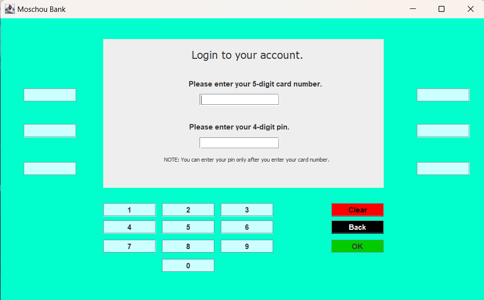
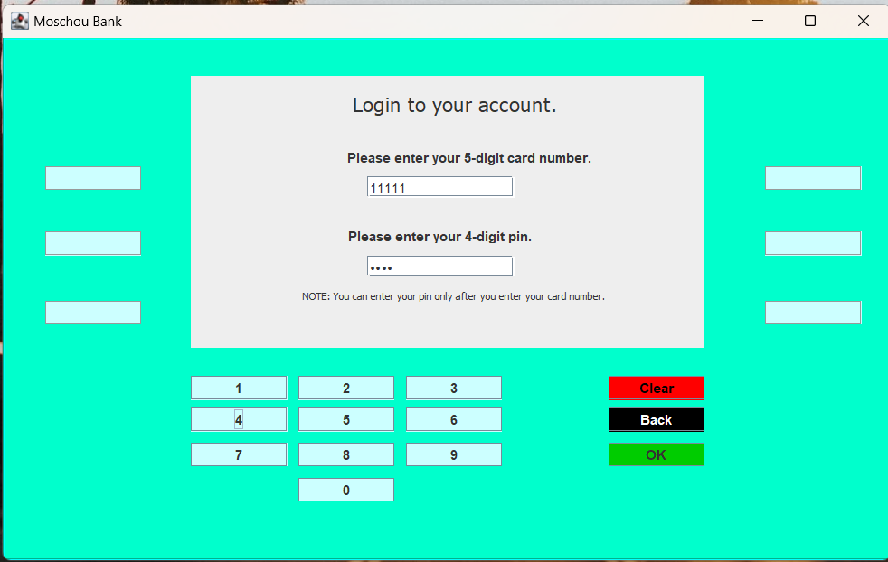
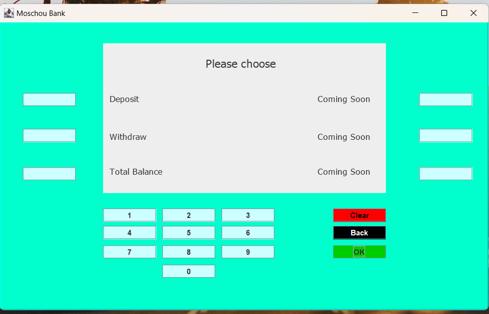

### Welcome to Moschou Bank

This is our atm. Feel free to use it! 

### 📷 Screenshots
#### Login process
 <br>
 <br>

#### Main Window


### Requirements
You will need Java installed on your PC. <br>
The next thing you will need is a MySQL Server. You can either download it from the official site <br>
or you can download xampp which is a package with some servers pre-installed. <br>
You can find online help about how to set these tools up.<br>
I used xampp package. <br>

### Before you run the app
Either you have set up MySQL Server on your own or you have downloaded xampp you will need to do some things<br>
before you will run the app for the first time. <br>

First you will need to run the code of ```dbCreation.sql``` file in order to create the database.<br>
Then, create a user in the database with the following credentials (Find online help about how to do it on MySQL Server itself or on xampp package): <br>

Username: ```simple``` <br>
Password: ```!@#$%^&*()``` <br>

In real life these credentials must not be public just like I did here.<br>
It is just a proof of concept but these are the credentials that app uses to have access in the database. <br>

For security reasons, this user must have the least amount of privileges in the system. <br>
In my configuration, this user does not have any privilege on the entire server. He only has ```select``` and ```update``` privileges <br>
on ```users``` table of ```moschoubank``` database. Find online resources about how to set user's privileges. <br>

The above steps are necessary only before you will run the app for the first time. <br>
After you will complete all the previous steps, you will be able to run the app whenever you want without having to set anything up. <br>

### Keep in mind
Make sure that MySQL Server is turned on every time before you run the app. <br>
Then double click on the ```atm.jar``` file (inside the runnable jar folder) and you are ready to go.<br>
The source code of the project is also provided if you want to import it to an IDE and run it from there (It is an Eclipse project). <br><br>

### How it works
User enters his card number and after that he enters the pin. <br>
Only deposit, withdraw and show balance operations are implemented. <br>
In every successful transaction, app will update the ```users``` table of the database. <br>

You can use my test account: <br><br>
Card Number: ```11111``` <br>
Pin: ```1234``` <br><br>

### Possible improvements
The following statements are some suggestions for improvement:

Create card activation and change pin processes. <br>
Enter more customers to the app. <br>
Make use of encryption algorithms in order to make the credentials more secure. <br>
With 3 failed attemps to login, system will lock user's account and administrator must unlock the account from the database. <br>
